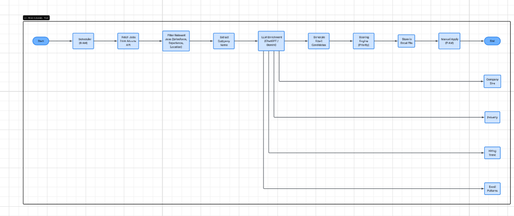

# AI-Powered Job Intelligence & Application Assistant

## Overview
* 
    This project is a Job Aggregation System that collects job listings from multiple sources and enriches them using an LLM. 

## Objective
---
To design and develop an AI-powered system that:
- Automates job data collection
- Enhances company insights using LLMs
- Prioritizes job opportunities
- Generates ready-to-use application drafts
- Improves efficiency while keeping the final application step manual

## Integrates:
* 
    Job APIs (Adzuna, Apify/LinkedIn)
    AI enrichment using LLM
    Data storage (Excel + Salesforce)

## System automates:
*   
    Job fetching
    Data enrichment
    Email generation
    Salesforce integration
    ---

## Features
---
* 
    Fetch jobs from multiple APIs
    AI-based company insights & email generation
    Export job data to Excel
    Push data into Salesforce
    Async processing using aiohttp

## Tech Stack
*   
    Python
        Async Libraries: aiohttp, asyncio
        Data Handling: pandas
    APIs:
        Adzuna Jobs API
        Apify (LinkedIn Jobs Scraper)
    AI Integration:
        OpenAI API
        Google Gemini API
    CRM Integration:
        Salesforce

## Project Structure:
---
*   ├── AdzunaJobService.py     # Fetch jobs from Adzuna API
    ├── apifyjobsearch.py       # Fetch LinkedIn jobs using Apify
    ├── AIClient.py             # LLM integration (Gemini/OpenAI)
    ├── EmailSender.py          # Email sending logic
    ├── SfDataService.py        # Salesforce integration
    ├── Constant.py             # Environment variable keys
    ├── .env                    # API keys (not committed)

## Architecture Diagram

                    +----------------------+
                    |      User / CLI      |
                    +----------+-----------+
                            |
                            v
                    +----------------------+
                    |   Main Application   |
                    | (Async Orchestrator) |
                    +----------+-----------+
                            |
            -----------------------------------------
            |                                       |
            v                                       v
    +----------------------+           +--------------------------+
    |  AdzunaJobService    |           |   ApifyJobSearch         |
    | (Adzuna API)         |           | (LinkedIn via Apify API) |
    +----------+-----------+           +------------+-------------+
            |                                    |
            ----------- Raw Job Data -------------
                            |
                            v
                    +----------------------+
                    |   Data Processing    |
                    |  (Normalize JSON)    |
                    +----------+-----------+
                            |
                            v
                    +----------------------+
                    |      AIClient        |
                    |  (LLM Enrichment)    |
                    |  - Gemini / OpenAI   |
                    +----------+-----------+
                            |
            -----------------------------------------
            |                    |                  |
            v                    v                  v
    +----------------+   +----------------+   +----------------------+
    | Email Drafting |   | Company Info   |   | Skill Enhancement    |
    | (Auto Content) |   | (Size, Email)  |   | (AI Generated Data)  |
    +----------------+   +----------------+   +----------------------+
                            |
                            v
                    +----------------------+
                    |   Final Job Data     |
                    +----------+-----------+
                            |
            -----------------------------------------
            |                                       |
            v                                       v
    +----------------------+           +----------------------+
    |   Excel Export       |           |   Salesforce (CRM)   |
    | (Pandas)             |           | (SFDataService)      |
    +----------------------+           +----------------------+

## Workflow
---
* Fetch jobs from:
    Adzuna API
    Apify (LinkedIn)
* Normalize & process job data
* Send data to LLM:
    Generate email drafts
    Extract company insights
    Enhance job details
* Store results:
    Excel file
    Salesforce

## Process Flow Diagram. 

